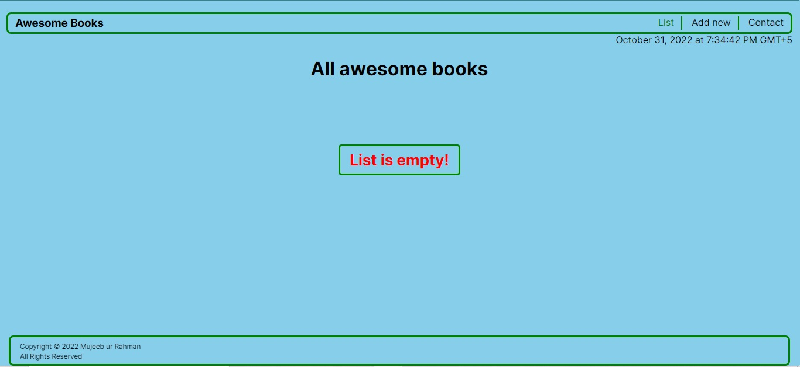
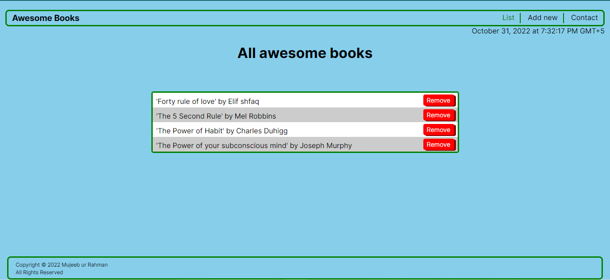
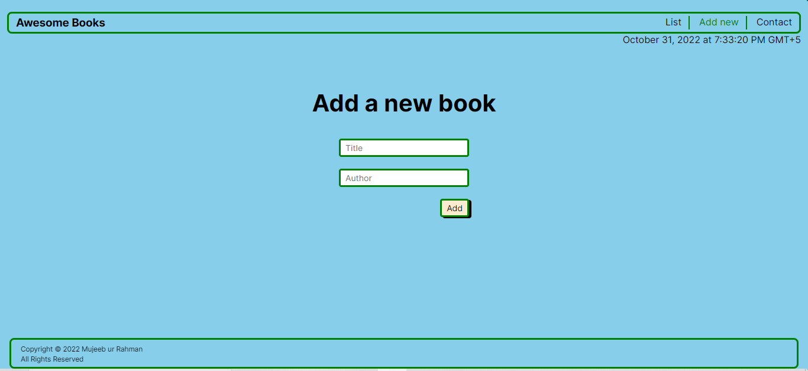
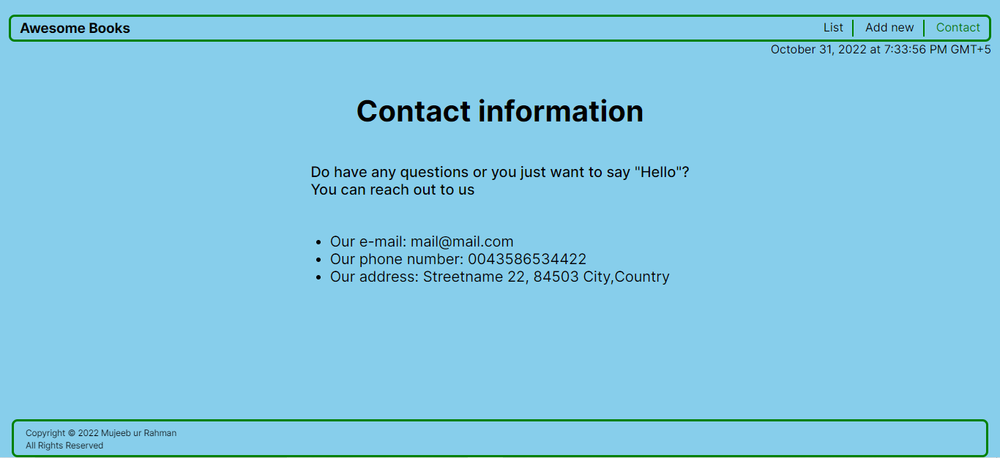

# Awesome Books with ES6

> In this project, we built a basic website that allows users to add or remove books from a list. By designing this website, we learned different concepts of JavaScript such as Class, objects, array, local storage, and DOM manipulation.  

## Browser Display










## Built With

- Major languages(HTML, ES6-JAVASCRIPT & CSS)
- Frameworks(NONE)
- Technologies used(GIT, GITHUB, VSCODE)

## Live Demo (if available)

[Live Demo Link](https://mujeeb4582.github.io/Awesome-books/)


## Getting Started

**This is an example of how you may give instructions on setting up your project locally.**
**Modify this file to match your project, remove sections that don't apply. For example: delete the testing section if the currect project doesn't require testing.**


To get a local copy up and running follow these simple example steps.

### Prerequisites
- Browser
- git
- code editor

### Setup
To get a local copy up and running follow these simple example steps.

- Clone the repository using:
```
    git clone git@github.com:Qoosim/Awesome-Books.git 
```
- Navigate to the Awesome-Books with this command 
```
    cd Awesome-Books
```

- Install Visual Studio extension [Live Server](https://marketplace.visualstudio.com/items?itemName=ritwickdey.LiveServer)

### Usage
- Open in browser
- Add and remove books

## Authors

👤 **Mujeeb ur Rahman**

-  GitHub: [@Mujeeb4582](https://github.com/Mujeeb4582)
- Twitter: [@Mujeebu93992980](https://twitter.com/Mujeebu93992980)
- LinkedIn: [mujeeb-ur-rahman-54268011a](https://linkedin.com/in/mujeeb-ur-rahman-54268011a)

## 🤝 Contributing

Contributions, issues, and feature requests are welcome!

Feel free to check the [issues page](../../issues/).

## Show your support

Give a ⭐️ if you like this project!

## Acknowledgments

- Thanks to the Microverse team for the great curriculum.
- Thanks to the Code Reviewer(s) for the insightful feedback.
- A great thanks to My coding partner(s), morning session team, and standup team for their contributions.
- Hat tip to anyone whose code was used.

## 📝 License

This project is [MIT](./LICENSE) licensed.

_NOTE: we recommend using the [MIT license](https://choosealicense.com/licenses/mit/) - you can set it up quickly by [using templates available on GitHub](https://docs.github.com/en/communities/setting-up-your-project-for-healthy-contributions/adding-a-license-to-a-repository). You can also use [any other license](https://choosealicense.com/licenses/) if you wish._